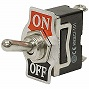

# This is a repository for Toogle Feature presentation/video

## Feature Toggle
Initial idea was coined here [Martin Fowler blog](https://www.martinfowler.com/articles/feature-toggles.html).
After that time lot of other interesting articles have been created, like this one [introduction-to-feature-toggles-and-implementation-best-practices](https://medium.com/darrensimio/introduction-to-feature-toggles-and-implementation-best-practices-4c2a8a68927b). If you are looking for more information please visit [https://featureflags.io/java-feature-flags/](https://featureflags.io/java-feature-flags/).

## Important concepts
### Toggle
This is the software representation of 
. 
This If statement used in a good way :)
### Toggle types
As per [feature-toggles](https://martinfowler.com/articles/feature-toggles.html) toggles can be divided as:
* Release Toggles - used to enable trunk development for teams
* Experimental Toggles - used to perform variety of experiments, A/B testing and more
* Ops Toggles - used to control running system like for performance for example
* Permissioning Toggles - may be used to implement "premium" or "alpha/beta" features
### Toggle Configuration
Used to define when and how to activate toogle.
It can be defined as:
* cookie param
* environmental variable
* user role
* HTTP header
* many, many more ...
### Toggle Context
Application state and configuration used to determine if toggle is active or not.
### Toggle Router
Is used to dynamically route application flow base on feature configuration and application context. Can be implemented as simple flag or full blown enterprice system.

## Notable implementations
* [https://github.com/tacitknowledge/flip](https://github.com/tacitknowledge/flip)
* [https://github.com/ff4j/ff4j](https://github.com/ff4j/ff4j)
* [https://github.com/togglz/togglz](https://github.com/togglz/togglz)
* [https://github.com/Unleash/unleash](https://github.com/Unleash/unleash)

### Trivia:
Faeture toggle is also know as: Feature Flag, Feature Bit, or Feature Flipper.
